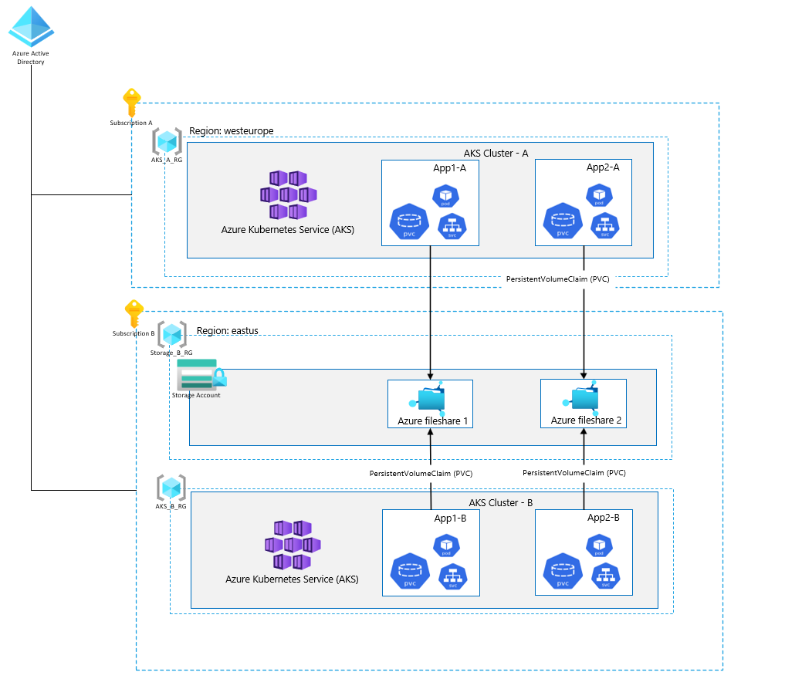

#  Persisting data from multiple AKS cluster to a centralized Azure File Share
The code base contains a solution for persisting data from multiple AKS clusters residing in different subscriptions to one centralized Azure File Share.


## Introduction
This example instructions will walk you through how to integrate two AKS cluster residing in different subscriptions with a centralized storage account. 


## Solution
 In this example we are creating a separate resource group for holding the storage account, with a lock set to **CanNotDelete** the storage account, in order to protect the data when deleting a PVC claim in AKS.



## Prequsities

- Subscription A and B resides under the same tenant.
- Azure Kubernetes cluster is running in both subscription A and subscription B
- Need to have Owner or User access administrator role to apply permissions in subscription B
- Access to subscription A and B.

## Preparation

### 1. Create environment variables

```bash
AKS_A_RG= < The name of AKS CLUSTER RESOURCE GROUP IN SUBSCRIPTION A >
AKS_A_CLUSTER=< The name of the AKS CLUSTER IN SUBSCRIPTION A >
AKS_B_RG= < The name of AKS CLUSTER RESOURCE GROUP IN SUBSCRIPTION B >
AKS_B_CLUSTER= < The name of the AKS CLUSTER IN SUBSCRIPTION B>
SUBSCRIPTION_ID_A = < SUBSCRIPTION ID OF SUBSCRIPTION A >
SUBSCRIPTION_ID_B= < SUBSCRIPTION ID OF SUBSCRIPTION B >
STORAGE_ACCOUNT_B_RG = < THE NAME OF THE RESOURCE GROUP IN SUBSCRIPTION B WERE STORAGE ACCOUNT RESIDES  >
STORAGE_ACCOUNT_NAME= < THE NAME OF THE STORAGE ACCOUNT IN SUBSCRIPTION B  >
AZURE_FILE_SHARE_NAME=< THE NAME OF THE FILE SHARE  >
```  
## Procedure

### 1. Create storage account
```powershell
 az account set --subscription $SUBSCRIPTION_ID_B
 az storage account create -n $STORAGE_ACCOUNT_NAME -g $STORAGE_ACCOUNT_B_RG -l westeurope --sku Standard_LRS
 STORAGE_ACCOUNT_B=$(az storage account show -g $STORAGE_ACCOUNT_B_RG -n $STORAGE_ACCOUNT_NAME --query 'id' --output tsv)
 az lock create --lock-type CanNotDelete --name dataProtect --resource $STORAGE_ACCOUNT
```  
### 2. Retrieve AKS service principal for AKS A and AKS B
We need to provide AKS cluster permission to create fileshare in the storage account as well as obtaining access keys to have permission to read and create files.
```powershell
az account set --subscription $SUBSCRIPTION_ID_A
SPN_A_OBJECT_ID=$(az aks show -g AKS_A_RG --name AKS_A_CLUSTER --query identity.principalId --output tsv)
az account set --subscription $SUBSCRIPTION_ID_B
SPN_B_OBJECT_ID=$(az aks show -g $AKS_B_RG --name $AKS_B_CLUSTER --query identity.principalId --output tsv)
```  
### 3. Create a role assignment
```powershell
az role assignment create --assignee-object-id $SPN_B_OBJECT_ID --assignee-principal-type ServicePrincipal --role 'Storage Account Contributor' --scope $STORAGE_ACCOUNT_B

az role assignment create --assignee-object-id $SPN_A_OBJECT_ID --assignee-principal-type ServicePrincipal --role 'Storage Account Contributor' --scope $STORAGE_ACCOUNT
```
### 4. Connect to AKS cluster in Subscription B
```powershell
az aks get-credentials --resource-group $AKS_B_RG --name $AKS_B_CLUSTER
```
### 5. Create a storage class in AKS

```yaml
kubectl apply -f - <<EOF
kind: StorageClass
apiVersion: storage.k8s.io/v1
metadata:
  name: my-azurefile
provisioner: file.csi.azure.com 
allowVolumeExpansion: true
mountOptions:
  - dir_mode=0777
  - file_mode=0777
  - uid=0
  - gid=0
  - mfsymlinks
  - cache=strict
  - actimeo=30
parameters:
  skuName: Standard_LRS
  subscriptionID: $SUBSCRIPTION_ID_B
  resourceGroup: $STORAGE_ACCOUNT_B_RG
  shareName: $AZURE_FILE_SHARE_NAME
EOF
```
### 6. Create Persistent volume claim
when creating the PVC, it will automatically create the fileshare in the storage account.

```yaml
kubectl apply -f - <<EOF
apiVersion: v1
kind: PersistentVolumeClaim
metadata:
  name: my-azurefile
spec:
  accessModes:
    - ReadWriteMany
  storageClassName: my-azurefile
  resources:
    requests:
      storage: 100Gi
EOF
```
### 7. Mount the Persisten volume to Pod

```yaml
kubectl apply -f - <<EOF
kind: Pod
apiVersion: v1
metadata:
  name: mypod
spec:
  containers:
  - name: mypod
    image: nginx:1.15.5-alpine
    resources:
      requests:
        cpu: 100m
        memory: 128Mi
      limits:
        cpu: 250m
        memory: 256Mi
    volumeMounts:
    - mountPath: "/mnt/azure"
      name: volume
  volumes:
    - name: volume
      persistentVolumeClaim:
        claimName: my-azurefile
EOF
```
### 8. Validate setup
In this example we will exec into the test pod and see if we can create a file and store it in our new mount path /mnt/azure.
```bash
kubectl exec -it mypod -- bash
touch /mnt/azure/helloworld.txt
echo 'From AKS_B' > helloworld.txt
```
helloworld.txt file should now be created and visible in your file share.

### 9. Connect to AKS cluster in Subscription A
```powershell
 az aks get-credentials --resource-group $AKS_A_RG --name AKS_A_CLUSTER
```


### 10. Create a storage class in AKS

```yaml
kubectl apply -f - <<EOF
kind: StorageClass
apiVersion: storage.k8s.io/v1
metadata:
  name: my-azurefile
provisioner: file.csi.azure.com 
allowVolumeExpansion: true
mountOptions:
  - dir_mode=0777
  - file_mode=0777
  - uid=0
  - gid=0
  - mfsymlinks
  - cache=strict
  - actimeo=30
parameters:
  skuName: Standard_LRS
  subscriptionID: $SUBSCRIPTION_ID_B
  resourceGroup: $STORAGE_ACCOUNT_B_RG
  shareName: $AZURE_FILE_SHARE_NAME
EOF
```
### 11. Create Persistent volume claim
when creating the PVC, it will automatically create the fileshare in the storage account.

```yaml
kubectl apply -f - <<EOF
apiVersion: v1
kind: PersistentVolumeClaim
metadata:
  name: my-azurefile
spec:
  accessModes:
    - ReadWriteMany
  storageClassName: my-azurefile
  resources:
    requests:
      storage: 100Gi
EOF
```
### 12. Mount the Persisten volume to Pod

```yaml
kubectl apply -f - <<EOF
kind: Pod
apiVersion: v1
metadata:
  name: mypod
spec:
  containers:
  - name: mypod
    image: nginx:1.15.5-alpine
    resources:
      requests:
        cpu: 100m
        memory: 128Mi
      limits:
        cpu: 250m
        memory: 256Mi
    volumeMounts:
    - mountPath: "/mnt/azure"
      name: volume
  volumes:
    - name: volume
      persistentVolumeClaim:
        claimName: my-azurefile
EOF
```
### 13. Validate setup
In this example we will exec into the test pod and see if we can create a new file and append an existing file.
```bash
kubectl exec -it mypod -- bash
touch /mnt/azure/helloworldagain.txt
echo 'From AKS_A' >> helloworld.txt $$ echo 'From AKS_A' >> helloworldagain.txt
```

### 14. Conclusion
 - You should now have a storage account, which is shared by two AKS cluster residing in differen subscriptions.
 - Your storage account is protected by Azure locks, to ensure accidental deletion of azure file share doesnt occur.
    - example: when deleting the PVC in kubernetes it will automatically remove the azure file share with all data, with Azure lock, you can now delete your PVC in kubernetes without affecting the azure file share or its content.


### 15. Credits
 A Massive thanks to
  - **Peter Lithner** for his support